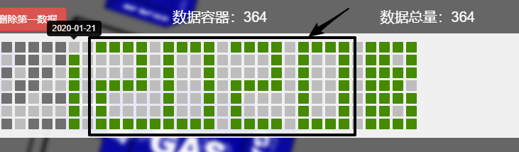
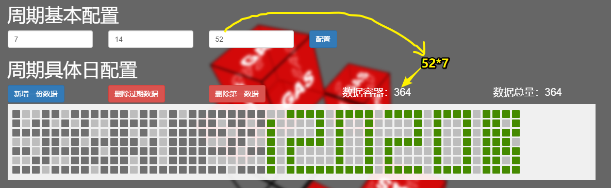
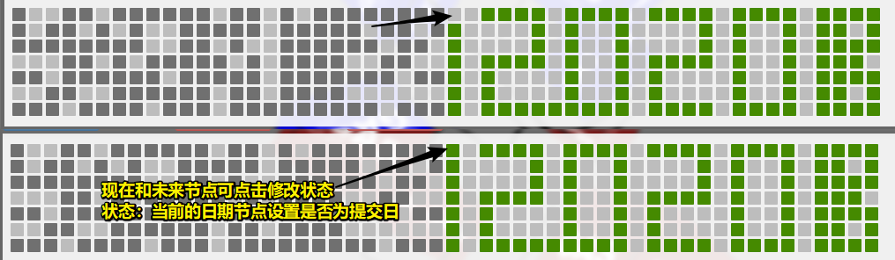
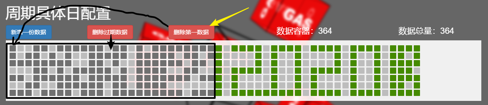

# GAS_server

## 简介

* 设置GitHub上的目标项目在服务器自动 `push commit`以保持 `GitHub上contributions` 常绿状态；
* 手动配置Github上的常绿的日期，可设置特定的图形，例如：2020
* 颜色点：（可配置图形的日期点）
  * 深灰色点：过期提交日；
  * 绿色点：现在和未来提交日
  * 浅灰色：非提交日

* 所有的配置都是围绕提交日进行设置，所以该服务可以理解为GAS_server端有关push日定制的配置；
* client端：跨域请求GAS_server端的数据，看当前日期是否为Push日；

## 思路

* 配置周期基础数据，用于新增一份周期数据，在最大和最小之间确定某些日期为Push日；
* 新增：
  * 手动：手动的意义可以指定特定的图案；
  * 自动：满足GitHub上自动提交代码的维护；
* 修改：新增的未来日期数据，都可以点击进行状态修改，从而指定特定的图案；
* 删除：
  * 可每次删除第一个过期数据：用于定制图案；
  * 可删除全部过期数据；
* client：
  * 请求若为提交日，返回当前client配置的数据包；
  * 如不是提交日（提交日但当前client配置为关闭状态、没有当前client配置）返回`res:-1`

## 配置：周期基础设置

- 周期数据：

  - 周期内最低push天数: min
  - 周期一份的长度： max
  - 全部数据的总周数：sum  （52 *7，模拟GitHub上显示就是52个周）

## add：一份

- 点击新增，查看当前数据总量有没有超过周期长度*7 ；

  - 若没有超过，则新增一份周期数据,新增在已经存在的数据的后面；

  - 若已经超过，不允许新增周期数据；

## upd：单个

- 点击未来日期节点，可以改变状态；

## del：单个

- 手动删除：第一个过期数据；
- 全部删除：全部过期数据；

## auto ：一份

* 自动：相当于是保险设置，如果自动新增也是依据于数据的总长度超过容器容量时，不再新增，就会失效；
* 所以应该包含：**自动新增和自动删除**；

- 自动新增：看返回的res
  - `res：-1`：数据的总长度超过容器容量
    - 找到第一条数据的 `time`
    - 找到周期长度的时间数据，**自动删除**`time + max*24*3600*1000`前面的旧数据；
  - 循环周期：`max*24*3600*1000` 
- 何时开启？
  - 项目运行后：运行自动服务，新增一份数据，开启定时器；
  - 周期基础设置重新修改后：清除定时器，不新增一份数据，只是开启定时器；（因为循环周期的max可能会变）

## client

- 功能：新增、列表、修改、删除；
  
- 配置client单项包含：
  
  - 项目名称：标识是哪个项目在进行参与自动提交；
  - 标识：用于和GAS_server请求数据的标识，返回相应自己的数据配置；
  - 状态：设置总开关，可以设置开或者关；
- **修改的文件路径：此项要依据于gas_client.js文件在什么位置**
  - 修改数据量的min和max：修改的文件这里能想到的就是json，文件里面保存是数据的数组。每次修改文件只是添加一条数据，设置上限和下限；
  - 日提交次数min和max：获取在中间的次数，进行相应的提交；次数不固定，时间也不固定；
  - JSON数据内容：每次添加一条数据添加什么数据；
  
- client业务

  - 后台请求返回：是否今日为提交日；

  - 若为提交日期：用约定的flag进行请求数据，请求配置,返回数据包：
  - 若不是提交日，或者 总开关关闭，或者没有查询数据，返回`res：-1`；

